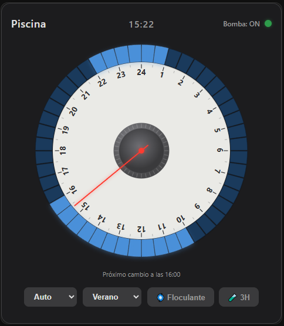

# 🏊 Pool Timer Card

[English](README.md) · **Español**

Una tarjeta personalizada para Home Assistant que reproduce un temporizador mecánico de piscina de 24 horas. Inspirada en los temporizadores analógicos de verdad, permite programar la bomba visualmente con segmentos interactivos de media hora — además de **presets** (Verano / Invierno) y **acciones temporizadas de tratamiento** (floculante / choque).



## Características

- 🪄 **Configuración en un clic** — crea sola los helpers necesarios (si eres admin) y corrige un `max` demasiado pequeño
- 🎛️ **48 segmentos interactivos** (30 min cada uno) — toca o arrastra para programar (en pantallas táctiles, un deslizamiento vertical hace scroll y uno horizontal pinta segmentos)
- ⏰ **Aguja horaria en tiempo real** — se actualiza sola
- 🔄 **3 modos de funcionamiento**: Auto / Perm / OFF
- 🗂️ **Presets** — un toque carga un horario completo (Verano / Invierno, por ejemplo), totalmente configurables
- 🌀 **Acción de floculante** — circula N horas y después **bloquea la bomba apagada** para que el floculante decante, hasta que aspires el fondo y pulses *reanudar*
- 🧪 **Acción de tratamiento** (choque / producto) — funciona N horas y después **vuelve automáticamente** al modo anterior
- 🔁 **Reintentos con espera exponencial** — verifica el estado de la bomba tras cada orden
- 🌐 **Multi-idioma**: inglés y español (detectado desde Home Assistant)
- 💾 **Persistente** — horario, modo, presets y acciones en curso se guardan en helpers de HA y sobreviven a las recargas
- 🤖 **Pensada para automatizar** — todo se guarda en helpers estándar
- 📱 **Adaptable** — funciona en escritorio y en móvil

## Instalación

> [!IMPORTANT]
> Instalar la tarjeta es **la mitad de la instalación**. La bomba la gobierna un
> **blueprint** en el servidor, y es lo que hace que el horario funcione con todos
> los navegadores cerrados. Sin él, la tarjeta solo actúa cuando la tocas, y nada
> vigila el horario por la noche.
>
> Son tres pasos, no uno:
> 1. Instalar la tarjeta (abajo)
> 2. Crear los [helpers necesarios](#helpers-necesarios) — la tarjeta puede hacerlo en un clic
> 3. **[Instalar el blueprint](#obligatorio-instalar-el-blueprint-funcionamiento-sin-navegador)**
>
> Desde la v2.12.0 la tarjeta comprueba si el blueprint está y te avisa si falta,
> para que no te enteres la noche en que la bomba no arranca.

### HACS (recomendado)

1. Abre HACS → Frontend → **Repositorios personalizados**
2. Añade la URL de este repositorio, categoría: **Lovelace**
3. Busca "Pool Timer Card" e instálala
4. Recarga el navegador (Ctrl+F5)

### Manual

1. Copia `pool-timer-card.js` a tu carpeta `/config/www/`
2. En HA, ve a **Ajustes → Paneles → Recursos**
3. Añade el recurso: `/local/pool-timer-card.js` (Módulo JavaScript)
4. Recarga el navegador

## Helpers necesarios

> 🪄 **Configuración automática (lo más fácil):** al añadir la tarjeta, si falta
> algún helper necesario —o si el `max` del helper del horario está por debajo de
> 48— la tarjeta muestra un botón **«Crear helpers» / «Arreglar»**. Si eres
> **administrador**, con un clic se crean los helpers (y se corrige el `max`) a
> través de la API de helpers de Home Assistant. A quien no lo sea le aparece un
> aviso para que se lo pida a un administrador. También puedes crearlos a mano
> como se describe abajo.

Créalos en **Ajustes → Dispositivos y servicios → Helpers**.

### 1. Almacenamiento del horario (`input_text`)

| Campo | Valor |
|-------|-------|
| Nombre | `pool_timer_schedule` |
| ID de entidad | `input_text.pool_timer_schedule` |
| Longitud máxima | `255` (debe ser **al menos 48**) |
| Valor inicial | **déjalo VACÍO** |

> ⚠️ **Importante (longitud):** el horario se guarda como una cadena de 48
> caracteres. Si la **longitud máxima del helper es menor de 48, Home Assistant
> rechaza el valor en silencio** y el horario no se guardará nunca. Ponlo a `255`
> para ir sobrado. Puedes ver el límite actual en **Herramientas de desarrollo →
> Estados** (atributo `max`).
>
> ⛔ **Importante (persistencia — NO pongas valor inicial):** si un helper tiene
> *Valor inicial*, Home Assistant **lo restablece a ese valor en cada reinicio**
> en vez de recuperar el último. Dejándolo vacío, el helper **conserva su último
> valor entre reinicios**. Poner un valor inicial aquí era la causa de que el
> horario se quedara todo apagado (y el modo volviera a Auto) después de cada
> reinicio de HA. La tarjeta siembra el horario sola la primera vez.

### 2. Almacenamiento del modo (`input_select`)

| Campo | Valor |
|-------|-------|
| Nombre | `pool_timer_mode` |
| ID de entidad | `input_select.pool_timer_mode` |
| Opciones | `Auto`, `Perm`, `OFF` |
| Valor inicial | **déjalo VACÍO** (no pongas `Auto`; mira el aviso de arriba, o el modo volverá a él en cada reinicio) |

### 3. Estado de acción / preset (`input_text`) — necesario para presets y acciones

| Campo | Valor |
|-------|-------|
| Nombre | `pool_timer_state` |
| ID de entidad | `input_text.pool_timer_state` |
| Longitud máxima | `255` |
| Valor inicial | *(déjalo vacío)* |

Este helper guarda un pequeño JSON que describe el preset activo y cualquier
acción temporizada en curso, por ejemplo
`{"preset":"Verano","action":"product","until":1718040000000,"ret":"Auto"}`.
Es lo que permite que una acción de floculante o tratamiento **se reanude
correctamente tras recargar**.

## Configuración

```yaml
type: custom:pool-timer-card
entity: switch.pool_pump                 # Tu entidad de la bomba (obligatorio)
name: Pool Timer                         # Título de la tarjeta (opcional)

# Helpers (opcional — estos son los valores por defecto)
schedule_entity: input_text.pool_timer_schedule
mode_entity: input_select.pool_timer_mode
state_entity: input_text.pool_timer_state

# Acciones rápidas temporizadas (opcional — estas son las de por defecto)
quick_actions:
  - name: "Floculante"
    hours: 2
    icon: "🌀"
    after: "OFF"
  - name: "Tratamiento"
    hours: 3
    icon: "🧪"
    after: "Auto"

# Presets (opcional — estos son los de por defecto)
presets:
  - name: Verano
    schedule:
      - { start: "08:00", end: "13:00" }
      - { start: "16:00", end: "20:00" }
  - name: Invierno
    schedule:
      - { start: "10:00", end: "13:00" }

# Botones de las esquinas (opcional — omítelo si no los necesitas)
corner_actions:
  - name: "Luz piscina"
    icon: "💡"
    position: "top-right"          # tl, tr, bl, br (o top-left, top-right, …)
    service: "light"
    entity_id: "light.pool_lights"
    action: "toggle"
  - name: "Arrancar robot"
    icon: "🤖"
    position: "bottom-right"
    service: "button"              # pulsa una entidad button de un solo disparo
    entity_id: "button.pool_robot_start"
    action: "press"
```

### Opciones de configuración

| Opción | Tipo | Obligatoria | Por defecto | Descripción |
|--------|------|-------------|-------------|-------------|
| `entity` | texto | ✅ | — | Entidad `switch` de la bomba |
| `name` | texto | ❌ | `Pool Timer` | Título de la tarjeta |
| `schedule_entity` | texto | ❌ | `input_text.pool_timer_schedule` | Helper con el horario de 48 segmentos |
| `mode_entity` | texto | ❌ | `input_select.pool_timer_mode` | Helper con el modo de funcionamiento |
| `state_entity` | texto | ❌ | `input_text.pool_timer_state` | Helper con el preset y la acción en curso |
| `preset_entity` | texto | ❌ | — | `input_select` cuyas opciones son los nombres de tus presets. Ponlo para guardar los presets en el servidor (ver [Presets en el servidor](#presets-en-el-servidor)) |
| `quick_actions` | lista | ❌ | Floculante, Tratamiento | Acciones temporizadas con `name`, `hours`, `icon`, `after` |
| `flocculant_hours` | número | ❌ | `2` | (Heredado) Horas de la acción de floculante |
| `product_hours` | número | ❌ | `3` | (Heredado) Horas de la acción de tratamiento |
| `presets` | lista | ❌ | Verano / Invierno | Horarios con nombre; cada uno con `name` y rangos en `schedule` |
| `corner_actions` | lista | ❌ | — | Botones de esquina, con `name`, `icon`, `position`, `service`, `entity_id`, `action` (ver [Acciones de esquina](#acciones-de-esquina-botones-rápidos)) |
| `schedule` | lista | ❌ | — | Horario inicial de una sola vez (solo se usa si el helper del horario está vacío) |

Un preset también puede darse como cadena cruda de 48 caracteres en vez de rangos:

```yaml
presets:
  - name: Custom
    segments: "111100000000111100000000000000000000000000000000"
```

## Modos de funcionamiento

| Modo | Comportamiento |
|------|----------------|
| **Auto** | La bomba sigue los segmentos programados |
| **Perm** | La bomba está siempre encendida (forzado) |
| **OFF** | La bomba está siempre apagada (forzado) |

**Selector de modo:**
- **Con presets** → menú desplegable (cambio más rápido de modo y preset)
- **Sin presets** → 3 botones (interfaz original)

## Presets

Usa el **desplegable de presets** (cuando tengas presets configurados) para:
- **Seleccionar un preset** y cargar su horario completo de 48 segmentos, pasando a **Auto**
- **Elegir «Custom»** para editar los segmentos a mano en la esfera

Cuando editas la esfera a mano, el selector pasa a **Custom** para que sepas que
estás en modo edición — **salvo** que tu edición coincida exactamente con un
preset configurado, en cuyo caso el selector salta a ese preset solo.

### Presets en el servidor

Por defecto los presets viven en el YAML de la tarjeta, lo que significa que solo
la tarjeta los conoce: una automatización que quiera aplicar «Verano» tiene que
repetir su cadena de 48 caracteres, y las dos se desincronizan en cuanto editas una.

Pon `preset_entity` y los presets se mudan a Home Assistant, donde las
automatizaciones y el blueprint pueden leerlos:

```yaml
type: custom:pool-timer-card
entity: switch.pool_pump
preset_entity: input_select.pool_timer_preset
```

Dos tipos de entidad lo sostienen:

| Entidad | Contiene |
|---|---|
| El `input_select` que hayas puesto | Sus **opciones son** los nombres de los presets, más `Custom` |
| Un `input_text` por preset | El horario de 48 caracteres de ese preset |

El `input_text` de un preset se localiza por su **nombre descriptivo** — `Pool
Timer Preset <nombre>` — no por su ID de entidad. Home Assistant no garantiza que
el ID de una entidad sea deducible de su nombre, así que el nombre es el enlace.
Si renombras un helper desde Ajustes, la tarjeta dará ese preset por ausente.

`Custom` no es un preset. Es la ausencia de coincidencia: la tarjeta lo selecciona
cuando tu horario no encaja con ninguno, y el blueprint lo ignora.

#### Migrar

Pulsa **«Crear helpers»** en la tarjeta una vez. Crea el `input_select` y un
`input_text` por preset, **sembrados con los horarios que tu YAML tiene hoy**.

A partir de ahí, las opciones del `input_select` son la lista de presets. Tu
bloque `presets:` deja de decidir qué presets existen — solo se consulta para
sembrar un helper que recrees más tarde, emparejando por nombre. Por eso, borrar
un preset desde la tarjeta lo hace desaparecer de verdad aunque su entrada del
YAML siga ahí.

No se rompe nada si no migras nunca: sin `preset_entity`, la tarjeta lee
`presets:` exactamente igual que antes.

#### Gestionar presets

Con `preset_entity` puesto, el editor visual de la tarjeta puede añadir, editar y
borrar presets.

**Los horarios se editan como rangos de horas**, la misma notación que usa el
`presets:` del YAML:

```
10:00-14:00, 16:00-19:30
```

La tarjeta convierte en ambos sentidos a la cadena de 48 caracteres que se
almacena. De esa conversión se derivan dos cosas, las dos deliberadas:

- Las horas se ajustan a medias horas, y el campo **se repinta con lo que quedó
  guardado de verdad**. Escribe `10:15-14:20` y te devuelve `10:00-14:00`: te
  enseña el horario que va a seguir la bomba, no el que tecleaste.
- Lo que no se puede interpretar se rechaza antes de escribir nada, así que un
  rango a medio teclear nunca llega al helper, ni de ahí a la bomba.

Un tramo que cruza la medianoche sobrevive intacto: `23:00-01:00` sigue siendo un
solo rango.

**Añadir** un preset crea la opción y su helper, sembrado con el horario que
tengas puesto en ese momento — así «+ Add Preset» significa «guarda lo que tengo».

**Borrar** requiere dos clics y elimina la opción **y su helper**, para que no se
acumulen helpers obsoletos.

El nombre es de solo lectura. Renombrar implicaría borrar y recrear el helper, así
que para renombrar borra el preset y créalo de nuevo.

> [!TIP]
> Una opción cuyo helper falte, esté vacío o malformado aparece en gris con un ⚠ y
> no se puede seleccionar — al elegirla no aplicaría nada mientras parece que sí.
> Pulsa **«Crear helpers»** para crear lo que falte, o rellena su horario.

> [!WARNING]
> Quitar una opción desde **Ajustes → Helpers** en vez de desde el editor de la
> tarjeta deja atrás su `input_text`. Home Assistant no tiene ni idea de que las
> dos entidades están relacionadas — solo el botón ✕ de la tarjeta sabe borrar las
> dos.

### Editar en pantallas táctiles

Para que el panel siga desplazándose con suavidad, la esfera distingue la
intención del gesto:

| Gesto | Acción |
|-------|--------|
| **Tocar** un segmento | Enciende o apaga esa media hora |
| **Arrastrar en horizontal** por el anillo | Pinta varios segmentos |
| **Deslizar en vertical** | Desplaza la página (**no** edita) |

Se puede editar en **cualquier** modo, incluido **OFF**.

## Acciones rápidas

Acciones temporizadas totalmente configurables que **anulan** el horario mientras
están activas y se guardan en `state_entity`, así que sobreviven a una recarga.

### Configuración

Define tantas como necesites:

```yaml
quick_actions:
  - name: "Floculante"
    hours: 2
    icon: "🌀"
    after: "OFF"              # Bloquea la bomba apagada hasta reanudar a mano
  - name: "Tratamiento"
    hours: 3
    icon: "🧪"
    after: "Auto"             # Vuelve al modo Auto al terminar
  - name: "Filtrado"
    hours: 1
    icon: "🔄"
    after: "Verano"           # Vuelve al preset "Verano"
```

**Parámetros:**
- `name` — etiqueta de la acción (por ejemplo «Floculante» o «Choque»)
- `hours` — duración en horas
- `icon` — emoji del botón (opcional)
- `after` — qué pasa cuando termina la acción:
  - `"OFF"` — bloquea la bomba apagada (estado de decantación) hasta que reanudes
  - `"Auto"` — vuelve al modo Auto con el horario actual
  - nombre de un preset (por ejemplo `"Verano"`) — carga ese preset

**Formato heredado** (sigue funcionando):
```yaml
flocculant_hours: 2
product_hours: 3
```

### Flujo de una acción

1. Pulsa el botón de la acción → la bomba funciona las horas configuradas.
2. La cuenta atrás se ve en la tarjeta.
3. Al terminar → se aplica el comportamiento de `after`.
4. Puedes cancelarla en cualquier momento con **Cancelar**.

> ⏱️ **Nota sobre fiabilidad:** la bomba la gobierna el blueprint en el servidor,
> así que las acciones temporizadas cambian a su hora **aunque no haya ningún
> navegador abierto**. Asegúrate de haber completado
> [Obligatorio: instalar el blueprint](#obligatorio-instalar-el-blueprint-funcionamiento-sin-navegador)
> — es parte de la instalación, no un extra.

## Acciones de esquina (botones rápidos)

Botones de un toque colocados en cualquiera de las **4 esquinas** de la esfera,
para controlar al instante entidades auxiliares: luces, jacuzzi, robot de
piscina, filtración… Sin temporizador: se ejecutan de inmediato.

### Configuración

Puedes configurarlas desde el **editor visual** (Editar tarjeta → sección
**Corner Actions** → *+ Add Corner Action*, y ahí el icono, nombre, esquina,
entidad, servicio y acción de cada fila) o directamente en YAML:

```yaml
corner_actions:
  - name: "Jacuzzi"
    icon: "🛁"
    position: "top-left"          # tl, tr, bl, br (o nombres completos)
    service: "switch"             # dominio del servicio de HA
    entity_id: "switch.jacuzzi"   # entidad a controlar
    action: "toggle"              # toggle, turn_on, turn_off

  - name: "Luz piscina"
    icon: "💡"
    position: "top-right"
    service: "light"
    entity_id: "light.pool_lights"
    action: "toggle"

  - name: "Robot piscina"
    icon: "🤖"
    position: "bottom-left"
    service: "switch"
    entity_id: "switch.pool_robot"
    action: "turn_on"
```

**Parámetros:**
- `name` — etiqueta y descripción emergente del botón (obligatorio)
- `icon` — emoji del botón (obligatorio)
- `position` — esquina (obligatorio): `"tl"` / `"top-left"`, `"tr"` / `"top-right"`, `"bl"` / `"bottom-left"`, `"br"` / `"bottom-right"`
- `service` — dominio del servicio de HA: `switch`, `light`, `button`, `script`, `scene`, `automation`, etc.
- `entity_id` — la entidad a controlar (obligatorio)
- `action` — qué hacer: `toggle`, `turn_on`, `turn_off`, `press` (para entidades `button`), `trigger` (para automatizaciones)

**Pulsar un botón** (por ejemplo una entidad `button` de «arrancar el robot»):
pon `service: button` y `action: press` (la tarjeta envía `button.press`). Los
dominios `button` y `scene` se normalizan solos, así que aunque dejes la acción
por defecto se disparan correctamente (`button.press` / `scene.turn_on`).

```yaml
corner_actions:
  - name: "Arrancar robot"
    icon: "🤖"
    position: "bottom-right"
    service: "button"
    entity_id: "button.pool_robot_start"
    action: "press"
```

**Respuesta visual:**
- Normal: solo el icono, con una sombra suave
- Al pasar por encima: el icono crece y brilla
- Activo (la luz está encendida): el icono se vuelve verde con brillo

**Limitaciones:**
- Máximo 4 acciones de esquina (una por esquina)
- Cada posición admite un solo botón
- Se ejecutan de inmediato (sin temporizador ni persistencia de estado)

## Mecanismo de reintentos

Cuando la tarjeta manda encender o apagar la bomba, comprueba el estado real a
los 2 segundos. Si no coincide:

1. Reintenta con **espera exponencial**: 2 s → 4 s → 8 s → 16 s → 32 s
2. Muestra un **LED naranja parpadeando** durante los reintentos
3. Tras 5 intentos fallidos, muestra un **LED rojo parpadeando rápido** 10 segundos
4. Después vuelve sola a la vigilancia normal

## Automatizaciones

Todo se guarda en helpers estándar, así que puedes gobernar la tarjeta desde HA.

```yaml
# Pasar a modo Perm cuando el agua está caliente
automation:
  - alias: "Bomba encendida con calor"
    trigger:
      - platform: numeric_state
        entity_id: sensor.pool_temperature
        above: 30
    action:
      - service: input_select.select_option
        target:
          entity_id: input_select.pool_timer_mode
        data:
          option: "Perm"
```

### Cambiar el horario desde una automatización

> [!IMPORTANT]
> Para cambiar el horario, escribe la **cadena de 48 caracteres** en el helper del
> horario. **No** escribas un nombre de preset en el helper de estado — eso solo
> cambia la etiqueta del desplegable, no cambia cuándo funciona la bomba.

El helper del horario es la única fuente de verdad: 48 caracteres, uno por media
hora, empezando a las 00:00. `1` = bomba encendida, `0` = apagada.

```yaml
# Horario de fin de semana: 09:00-13:00 y 16:00-20:00
automation:
  - alias: "Horario piscina fin de semana"
    trigger:
      - platform: time
        at: "00:05:00"
    condition:
      - condition: time
        weekday: [sat, sun]
    action:
      - service: input_text.set_value
        target:
          entity_id: input_text.pool_timer_schedule
        data:
          value: "000000000000000000111111110000001111111100000000"
```

Cada tarjeta abierta recoge el cambio al instante, y el blueprint lo aplica con
todos los navegadores cerrados. El desplegable de presets se actualiza solo: la
tarjeta compara el horario nuevo contra tus presets configurados y muestra el
nombre que coincida, o **Custom** si no coincide ninguno.

Para que la cadena sea fácil de mantener sincronizada con un preset, define los
presets con `segments:` en vez de con `schedule:` — así el YAML de la tarjeta y
tu automatización usan exactamente la misma cadena:

```yaml
presets:
  - name: Verano
    segments: "000000000000000011111111110000001111111100000000"
```

> [!TIP]
> Contar caracteres a mano es propenso a errores. Para obtener la cadena de un
> horario, móntalo en la esfera y lee el valor de
> `input_text.pool_timer_schedule` en **Herramientas de desarrollo → Estados**, y
> pégalo en tu automatización.

### Alternar entre dos horarios (entre semana / fin de semana)

Una necesidad habitual: un horario más largo el fin de semana y otro más corto
entre semana — pero solo mientras estés en «verano», sin tocar el de invierno.

**Con [presets en el servidor](#presets-en-el-servidor)** esta es la automatización
entera, sin una sola cadena de horario a la vista:

```yaml
alias: Piscina - horario de verano (corto entre semana, largo el finde)
triggers:
  - trigger: time
    at: "00:00:00"
  - trigger: homeassistant
    event: start
conditions:
  # Solo mientras haya un preset de verano activo — no toca Invierno ni un
  # horario pintado a mano.
  - condition: state
    entity_id: input_select.pool_timer_preset
    state: ["Verano", "Verano corto"]
actions:
  - action: input_select.select_option
    target:
      entity_id: input_select.pool_timer_preset
    data:
      option: >-
        {{ 'Verano' if now().isoweekday() in [6, 7] else 'Verano corto' }}
mode: single
```

Si editas un preset en la esfera, esta automatización aplica la versión nueva en
el siguiente cambio, porque es el mismo dato.

<details>
<summary>Sin presets en el servidor (escribiendo la cadena del horario)</summary>

```yaml
alias: Piscina - horario de verano (corto entre semana, largo el finde)
description: >-
  Alterna entre los dos horarios de verano. Solo actúa cuando el horario actual
  ya es uno de los dos, así que un horario de invierno o pintado a mano se queda
  como está.

variables:
  # 10:00-13:00 y 16:00-18:30
  verano_corto: "000000000000000000001111110000001111100000000000"
  # 10:00-14:00 y 16:00-19:30
  verano_largo: "000000000000000000001111111100001111111000000000"

triggers:
  - trigger: time
    at: "00:00:00"
  - trigger: homeassistant
    event: start

conditions:
  - condition: template
    value_template: >-
      {{ states('input_text.pool_timer_schedule') in [verano_corto, verano_largo] }}

actions:
  - choose:
      - conditions:
          - condition: time
            weekday: [sat, sun]
        sequence:
          - action: input_text.set_value
            target:
              entity_id: input_text.pool_timer_schedule
            data:
              value: "{{ verano_largo }}"
      - conditions:
          - condition: time
            weekday: [mon, tue, wed, thu, fri]
        sequence:
          - action: input_text.set_value
            target:
              entity_id: input_text.pool_timer_schedule
            data:
              value: "{{ verano_corto }}"

mode: single
```

#### Por qué está escrita así

**Compara la cadena del horario, no el nombre del preset.** El helper de estado sí
lleva un campo `preset`, pero desde la 2.9.5 ese nombre lo *deduce la tarjeta* y
es solo para mostrar: sin ningún panel abierto nadie lo mantiene al día, así que
una automatización que lo lea acabará actuando sobre un valor caducado. La cadena
de 48 caracteres es la fuente de verdad.

**Se ejecuta todos los días a las 00:00 y al arrancar Home Assistant**, no solo
los dos días del cambio. Los demás días escribe el valor que ya estaba, lo cual
no hace nada. Lo que ganas es que se autocorrige: si HA se reinicia un miércoles,
o cambias algo a mano, vuelves a estar en hora a la medianoche siguiente en vez de
quedarte mal hasta el lunes.

**La condición es lo que la hace segura.** Sin ella, esta automatización te
arrastraría a un horario de verano cada noche pasara lo que pasara. Con ella,
elegir `Invierno` o pintar tu propio horario simplemente te deja fuera hasta que
vuelvas a elegir un horario de verano.

**Ninguna variable referencia a otra variable.** Cada rama del `choose` lee una
sola variable de primer nivel. Las variables encadenadas
(`target: "{{ verano_largo if ... }}"`) fallan al renderizar en algunas versiones
de Home Assistant y abortan la ejecución en silencio — la misma trampa de la que
avisa el blueprint en sus propios comentarios.

> [!TIP]
> Haz que las dos cadenas coincidan **exactamente** con presets que tengas
> configurados. Cuando coinciden, el desplegable de la tarjeta muestra `Verano` o
> `Verano corto` después de que corra la automatización; cuando no, muestra
> **Custom** — lo cual es correcto, pero te está diciendo que tu automatización y
> tus presets se han desincronizado.

> [!NOTE]
> La cadena del horario está duplicada entre tu configuración `presets:` y esta
> automatización, y nada mantiene las dos sincronizadas: editar un preset en la
> esfera no cambia lo que aplica esta automatización. Eso es exactamente lo que
> eliminan los [presets en el servidor](#presets-en-el-servidor) — con ellos, la
> automatización de arriba se reduce a un solo `input_select.select_option`.

</details>

## Obligatorio: instalar el blueprint (funcionamiento sin navegador)

La tarjeta es la **interfaz**; el control real de la bomba corre **en el
servidor** de Home Assistant a través del **blueprint** incluido. Eso es lo que
hace que el horario funcione **24/7 aunque no haya ninguna pestaña abierta** —
sin él, la tarjeta solo refleja el estado y actúa cuando la tocas, pero nada
vigila el horario por su cuenta.

> ⚠️ **El blueprint es parte de la instalación, no un extra.** La tarjeta ya no
> gobierna la bomba con un temporizador propio; se lo delega al blueprint, que lee
> los mismos helpers y reproduce su lógica exacta (horario en Auto, Perm/OFF,
> acciones en curso, el bloqueo de decantación del floculante y la transición
> posterior).

### 1. Importar el blueprint

[](https://my.home-assistant.io/redirect/blueprint_import/?blueprint_url=https%3A%2F%2Fgithub.com%2Fserweck%2Fpool-timer-card%2Fblob%2Fmain%2Fblueprints%2Fpool_timer.yaml)

…o en HA: **Ajustes → Automatizaciones y escenas → Blueprints → Importar
blueprint**, y pega:

```
https://github.com/serweck/pool-timer-card/blob/main/blueprints/pool_timer.yaml
```

### 2. Crear una automatización a partir de él

Elige las cuatro entidades en los desplegables: la bomba y los tres helpers
(`schedule`, `mode`, `state`). No hace falta tocar YAML.

Hay una quinta entrada, **Preset helper**, opcional: ponla a tu `preset_entity` y
seleccionar un preset aplicará su horario en el servidor, sin ningún panel
abierto. Déjala vacía si aún no has movido los presets al servidor.

> [!IMPORTANT]
> ¿Vienes de una versión anterior a la 2.10.0? **Reimporta el blueprint** para que
> aparezca la entrada del helper de presets. Tus automatizaciones existentes
> siguen funcionando sin tocarlas hasta que lo hagas — la entrada nueva viene
> vacía por defecto.

Y ya está. La tarjeta se queda como pura interfaz y el blueprint es dueño de la
bomba; los toques explícitos en la tarjeta siguen actuando **al instante** para
que responda rápido, y el blueprint reconcilia el estado cada minuto (y justo
después de reiniciar Home Assistant).

## Idiomas

La tarjeta detecta el idioma de tu Home Assistant y muestra inglés o español.

## Resolución de problemas

**El horario no se guarda / los segmentos se reinician al recargar**

1. **Comprueba la longitud máxima del helper** (la causa más habitual). Ve a
   **Herramientas de desarrollo → Estados**, busca
   `input_text.pool_timer_schedule` y mira el atributo `max`. Debe ser **≥ 48**.
   Si es menor, HA rechaza el valor de 48 caracteres. Arréglalo en: **Ajustes →
   Helpers → pool_timer_schedule → ⚙️ → Longitud máxima → `255`**.
2. **Confirma que el helper acepta escrituras.** En **Herramientas de desarrollo →
   Acciones**, ejecuta `input_text.set_value` sobre la entidad con un valor de 48
   caracteres. Si el estado no cambia, el helper está mal configurado.
3. **Verifica que la tarjeta apunta a las entidades correctas**
   (`schedule_entity` / `mode_entity` / `state_entity` en su configuración).
4. **Asegúrate de haber cargado la última versión de la tarjeta** — abre la
   consola del navegador (F12) y comprueba el banner `POOL-TIMER-CARD vX.Y.Z`; si
   no es el que esperas, recarga forzando caché (Ctrl+Shift+R).

**Todo vuelve a los valores por defecto al reiniciar Home Assistant**

Significa que uno o más helpers tienen un **Valor inicial** puesto. HA restablece
el helper a ese valor en cada reinicio en vez de recuperar el último. Arregla cada
uno: **Ajustes → Dispositivos y servicios → Helpers →** abre `pool_timer_schedule`,
`pool_timer_mode` (y `pool_timer_state`) **→ ⚙️ → vacía el campo *Valor inicial***
→ Guardar. A partir de ahí conservan su último valor entre reinicios. (Desde la
v2.9.2 la tarjeta tampoco sobrescribe el helper durante el arranque.)

**Los presets o las acciones no persisten tras recargar**

Asegúrate de que existe `input_text.pool_timer_state` (helper nº 3) y de que su
`max` es ≥ 200.

**Los botones de modo no aplican**

Comprueba que existe `input_select.pool_timer_mode` y que sus opciones son
exactamente `Auto`, `Perm`, `OFF` (distinguen mayúsculas).

## Licencia

MIT © [serweck](https://github.com/serweck)
