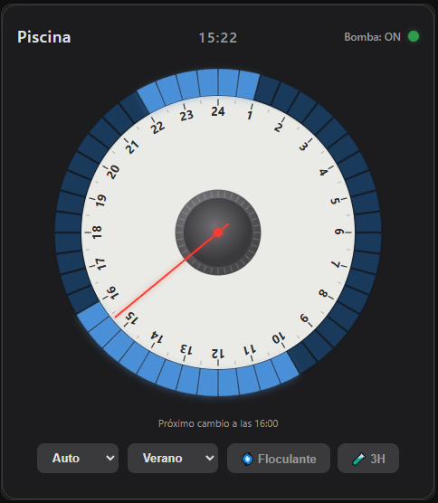

# 🏊 Pool Timer Card

A skeuomorphic 24-hour mechanical pool timer custom card for Home Assistant. Inspired by real analog pool timers, it lets you visually schedule your pool pump with interactive half-hour segments — plus **presets** (Summer / Winter) and **timed treatment actions** (flocculant / shock).



## Features

- 🪄 **One-click setup** — auto-creates the required helpers (admin) if missing, and fixes a too-small `max`
- 🎛️ **48 interactive segments** (30 min each) — click or drag to schedule
- ⏰ **Real-time clock needle** — auto-updates to show current time
- 🔄 **3 operation modes**: Auto / Perm / OFF
- 🗂️ **Presets** — one tap to load a full schedule (e.g. Summer / Winter), fully configurable
- 🌀 **Flocculant action** — circulate for N hours, then **lock the pump OFF** so the floc settles, until you vacuum the bottom and press *resume*
- 🧪 **Treatment action** (shock / product) — run for N hours, then **automatically return** to the previous mode
- 🔁 **Retry with exponential backoff** — verifies pump state after commands
- 🌐 **Multi-language**: English & Spanish (auto-detected from HA)
- 💾 **Persistent** — schedule, mode, presets and running actions stored in HA helpers; survive dashboard reloads
- 🤖 **Automation-friendly** — everything is stored in standard helpers
- 📱 **Responsive** — works on desktop and mobile

## Installation

### HACS (Recommended)

1. Open HACS → Frontend → **Custom repositories**
2. Add this repo URL, category: **Lovelace**
3. Search for "Pool Timer Card" and install
4. Refresh your browser (Ctrl+F5)

### Manual

1. Copy `pool-timer-card.js` to your `/config/www/` folder
2. In HA, go to **Settings → Dashboards → Resources**
3. Add resource: `/local/pool-timer-card.js` (JavaScript Module)
4. Refresh your browser

## Required Helpers

> 🪄 **Automatic setup (easiest):** when you add the card and any required helper
> is missing — or the schedule helper's `max` is below 48 — the card shows a
> **"Create helpers" / "Fix it"** button. If you are an **admin**, one click
> creates the helpers (and fixes the `max`) for you via Home Assistant's helper
> API. Non-admins get a note to ask an admin. You can still create them manually
> as described below.

Create these helpers in **Settings → Devices & Services → Helpers**.

### 1. Schedule storage (`input_text`)

| Field | Value |
|-------|-------|
| Name | `pool_timer_schedule` |
| Entity ID | `input_text.pool_timer_schedule` |
| Max length | `255` (must be **at least 48**) |
| Initial value | `000000000000000000000000000000000000000000000000` |

> ⚠️ **Important:** the schedule is stored as a 48-character string. If the
> helper's **maximum length is below 48, Home Assistant silently rejects the
> value** and the schedule will never save. Set it to `255` to be safe. You can
> check the current limit in **Developer Tools → States** (the `max` attribute).

### 2. Mode storage (`input_select`)

| Field | Value |
|-------|-------|
| Name | `pool_timer_mode` |
| Entity ID | `input_select.pool_timer_mode` |
| Options | `Auto`, `Perm`, `OFF` |
| Initial value | `Auto` |

### 3. Action / preset state (`input_text`) — required for presets & actions

| Field | Value |
|-------|-------|
| Name | `pool_timer_state` |
| Entity ID | `input_text.pool_timer_state` |
| Max length | `255` |
| Initial value | *(leave empty)* |

This helper stores a small JSON blob describing the active preset and any
running timed action, e.g. `{"preset":"Verano","action":"product","until":1718040000000,"ret":"Auto"}`.
It is what lets a flocculant/treatment action **resume correctly after a reload**.

## Configuration

```yaml
type: custom:pool-timer-card
entity: switch.pool_pump                 # Your pump switch entity (required)
name: Pool Timer                         # Card title (optional)

# Helpers (optional — these are the defaults)
schedule_entity: input_text.pool_timer_schedule
mode_entity: input_select.pool_timer_mode
state_entity: input_text.pool_timer_state

# Timed quick actions (optional — these are the defaults if omitted)
quick_actions:
  - name: "Flocculant"
    hours: 2
    icon: "🌀"
    after: "OFF"
  - name: "Treatment"
    hours: 3
    icon: "🧪"
    after: "Auto"

# Presets (optional — these are the defaults if omitted)
presets:
  - name: Verano
    schedule:
      - { start: "08:00", end: "13:00" }
      - { start: "16:00", end: "20:00" }
  - name: Invierno
    schedule:
      - { start: "10:00", end: "13:00" }
```

### Configuration Options

| Option | Type | Required | Default | Description |
|--------|------|----------|---------|-------------|
| `entity` | string | ✅ | — | Switch entity for the pool pump |
| `name` | string | ❌ | `Pool Timer` | Card title |
| `schedule_entity` | string | ❌ | `input_text.pool_timer_schedule` | Helper storing the 48-segment schedule |
| `mode_entity` | string | ❌ | `input_select.pool_timer_mode` | Helper storing the operation mode |
| `state_entity` | string | ❌ | `input_text.pool_timer_state` | Helper storing preset + running action |
| `quick_actions` | list | ❌ | Flocculant, Treatment | Array of timed actions with `name`, `hours`, `icon`, `after` |
| `flocculant_hours` | number | ❌ | `2` | (Legacy) Hours for flocculant action |
| `product_hours` | number | ❌ | `3` | (Legacy) Hours for treatment action |
| `presets` | list | ❌ | Verano / Invierno | Named schedules; each has `name` + `schedule` ranges |
| `schedule` | list | ❌ | — | One-time default schedule (used only when the schedule helper is empty) |

A preset can also be given as a raw 48-char string instead of ranges:

```yaml
presets:
  - name: Custom
    segments: "111100000000111100000000000000000000000000000000"
```

## Operation Modes

| Mode | Behavior |
|------|----------|
| **Auto** | Pump follows the programmed schedule segments |
| **Perm** | Pump is always ON (override) |
| **OFF** | Pump is always OFF (override) |

**Mode selector UI:**
- **With presets** → dropdown menu (faster mode + preset switching)
- **Without presets** → 3 buttons (original UI)

## Presets

Use the **Presets dropdown** (when you have presets configured) to:
- **Select a preset** to load its full 48-segment schedule and switch to **Auto**
- **Choose "Custom"** to edit segments manually on the dial

When you manually edit the dial, the preset automatically switches to **Custom** so
you know you're in edit mode. Presets are defined in the card YAML (`presets:`)
and editing does not modify the original preset definition.

## Quick Actions

Fully configurable timed actions that **override** the schedule while active and
are stored in `state_entity`, so they survive a dashboard reload.

### Configuration

Define as many actions as you need:

```yaml
quick_actions:
  - name: "Flocculant"
    hours: 2
    icon: "🌀"
    after: "OFF"              # Lock pump OFF until manually resumed
  - name: "Treatment"
    hours: 3
    icon: "🧪"
    after: "Auto"             # Return to Auto mode after
  - name: "Filtrado"
    hours: 1
    icon: "🔄"
    after: "Verano"           # Return to the "Verano" preset
```

**Parameters:**
- `name` — action label (e.g. "Flocculant", "Shock")
- `hours` — duration in hours
- `icon` — emoji for the button (optional)
- `after` — what happens when the action finishes:
  - `"OFF"` — lock the pump OFF (settling state) until user resumes
  - `"Auto"` — return to Auto mode with the current schedule
  - preset name (e.g. `"Verano"`) — load that preset

**Legacy format** (still works):
```yaml
flocculant_hours: 2
product_hours: 3
```

### Action flow

1. Tap an action button → pump runs for the configured hours.
2. Timer counts down on the card.
3. When time expires → applies the `after` behavior.
4. You can cancel with the **Cancel** button anytime.

> ⏱️ **Reliability note:** the countdown is evaluated by the card itself, so the
> automatic transition only fires while a dashboard with this card is open in a
> browser somewhere (e.g. a wall tablet). The state is persists, so when you open
> the dashboard again it resumes/expires correctly. For fully unattended timing
> (browser closed), enforce it with the optional automation below.

## Retry Mechanism

When the card sends a command to turn the pump ON or OFF, it verifies the actual
state after 2 seconds. If the state doesn't match:

1. Retries with **exponential backoff**: 2s → 4s → 8s → 16s → 32s
2. Shows an **orange blinking LED** during retries
3. After 5 failed attempts, shows a **fast red blinking LED** for 10 seconds
4. Automatically resets to normal monitoring afterwards

## Automations

Everything is stored in standard helpers, so you can drive the card from HA.

```yaml
# Switch to Perm mode when water temperature is high
automation:
  - alias: "Pool pump on when hot"
    trigger:
      - platform: numeric_state
        entity_id: sensor.pool_temperature
        above: 30
    action:
      - service: input_select.select_option
        target:
          entity_id: input_select.pool_timer_mode
        data:
          option: "Perm"
```

### Optional: enforce a timed action server-side (browser-independent)

If you want the treatment action to end exactly on time even with no dashboard
open, add an automation that watches the `until` timestamp in the state helper:

```yaml
automation:
  - alias: "Pool: end treatment on time"
    trigger:
      - platform: time_pattern
        minutes: "/1"
    condition:
      - condition: template
        value_template: >
          
          {{ s.startswith('{') and (s | from_json).action == 'product'
             and (s | from_json).until | int(0) < now().timestamp() * 1000 }}
    action:
      # Return to the stored mode and clear the action
      - service: input_select.select_option
        target: { entity_id: input_select.pool_timer_mode }
        data:
          option: "{{ (states('input_text.pool_timer_state') | from_json).ret }}"
      - service: input_text.set_value
        target: { entity_id: input_text.pool_timer_state }
        data:
          value: "{}"
```

## Language Support

The card auto-detects your Home Assistant language and shows English or Spanish.

## Troubleshooting

**The schedule doesn't save / segments reset on reload**

1. **Check the helper's max length** (most common cause). Go to
   **Developer Tools → States**, find `input_text.pool_timer_schedule`, and look
   at the `max` attribute. It must be **≥ 48**. If it's lower, HA rejects the
   48-character value. Fix it: **Settings → Helpers → pool_timer_schedule →
   ⚙️ → Maximum length → `255`**.
2. **Confirm the helper accepts writes.** In **Developer Tools → Actions**, run
   `input_text.set_value` on the entity with a 48-char value. If the state
   doesn't change, the helper is misconfigured.
3. **Verify the card points at the right entities** (`schedule_entity` /
   `mode_entity` / `state_entity` in the card config).
4. **Make sure you loaded the latest card** — open the browser console (F12) and
   confirm the `POOL-TIMER-CARD vX.Y.Z` banner; hard-refresh (Ctrl+Shift+R) if not.

**Presets or actions don't persist after a reload**

Make sure `input_text.pool_timer_state` exists (helper #3) and its `max` is ≥ 200.

**The mode buttons don't apply**

Ensure `input_select.pool_timer_mode` exists and its options are exactly
`Auto`, `Perm`, `OFF` (case-sensitive).

## License

MIT © [serweck](https://github.com/serweck)
